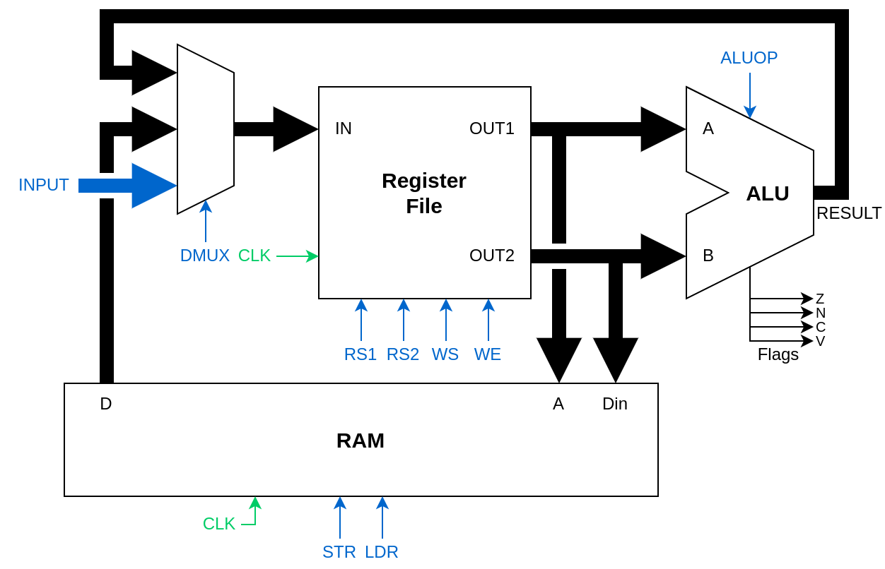

# 计算机组成原理

## 前言

这部分是使用java编写的底层digit电路软件搭建的从0开始的cpu计算机。通过构建基本元件再到复杂电路的过程，我们可以深入理解计算机硬件的工作原理，为学习高级计算机概念奠定基础。

---

## 一、基础逻辑组件

### 1.1 多路复用器（Multiplexer）

**原理**：多路复用器是一种用于从多个输入中选择一个输出的组合电路。通过控制信号决定哪个输入被传递到输出端。

**应用**：在CPU中用于选择要传递到总线的信号，如ALU的不同运算结果或数据来源。

### 1.2 分线器（Splitter）

**原理**：分线器能够输入二进制的集合来表示一组线路的电信号，然后把这一个输入拆成每条独立的线。

**应用**：用于把总线上的数据分解成单独的位，便于处理和控制。

### 1.3 常量值（Constant Value）

**原理**：提供固定的二进制值作为电路的输入，使用常数值组件 **Wires -> Constant Value**。

**应用**：生成特定的常数、掩码或地址偏移量等。

### 1.4 逻辑左移（Logical Shift Left）

**原理**：将二进制数向左移动特定位数，右侧补零。每左移一位，值翻倍。

**设计思路**：仅由分线器和常量值构成，无需额外逻辑门，通过重新连接位的顺序实现位移。

## 二、算术单元

### 2.1 半加器（Half Adder）

**原理**：实现一位二进制加法，只考虑一位的二进制加法，有两个输入（A和B）和两个输出（结果S和进位C）。

**逻辑组成**：
- 和(S) = A ⊕ B（异或）
- 进位(C) = A · B（与）

### 2.2 全加器（Full Adder）

**原理**：考虑进位的完整的一位二进制加法，有三个输入（A、B和进位输入Cin）和两个输出（和S和进位输出Cout）。

**设计思路**：使用两个半加器和一个OR门。第一个半加器处理A和B，第二个半加器处理第一个半加器的和与进位输入，两个半加器的进位通过OR门合并。

### 2.3 加减法器（Adder-Subtractor）

**原理**：在一个电路中同时实现加法和减法功能，通过控制信号sub决定执行哪种操作。

**设计思路**：
- 当sub=0时：执行A + B
- 当sub=1时：执行A - B，即A + (-B)

**巧妙之处**：把sub控制器接到c1这个进位输入的地方，同时用于控制是否对B取反，刚好能弥补只用一个加法器却没法实现减法的缺陷。当sub=1时，实现了二进制补码（取反加一）。

### 2.4 带进位的加法器（Carry Adder）

**原理**：通过级联多个全加器实现多位二进制加法，每个全加器处理一位，并将进位传递给下一位。

### 2.5 算术逻辑单元（ALU）

**原理**：CPU的核心计算部件，能执行多种算术和逻辑运算，包括加法、减法、逻辑与、逻辑或、逻辑非等。

**设计思路**：
- 集成加减法器和逻辑运算单元
- 通过操作码选择执行哪种运算
- 输出计算结果和状态标志（如零标志、进位标志）

## 三、存储单元

### 3.1 SR锁存器（SR Latch）

**原理**：最基本的记忆电路，能够存储一位信息，有两个输入：
- S（Set）：设置输出为1
- R（Reset）：设置输出为0

**工作方式**：当S=R=0时，输出保持原状态；当S=1,R=0时，输出为1；当S=0,R=1时，输出为0；当S=R=1时，状态不确定。

**比喻说明**：
想象一个有记忆的开关，它可以记住你最后对它做了什么操作：
- S按钮（Set）：按下这个按钮，灯就会亮起来，并且一直保持亮着
- R按钮（Reset）：按下这个按钮，灯就会熄灭，并且一直保持熄灭

最重要的是，当你松开两个按钮后（都不按），灯的状态不会改变 - 它会记住你最后的操作。

### 3.2 D锁存器（D Latch）

**原理**：从SR锁改进而来，解决了S=R=1时的不确定状态问题。

**设计思路**：
- 只有一个数据输入D和一个使能输入EN
- 当EN=1时，输出跟随D的值
- 当EN=0时，保持当前状态
- 本质上是考虑四种情况后，如何将D和EN组合后输入到SR锁存器

### 3.3 D触发器（D Flip-Flop）

**原理**：边沿触发的存储元件，只有在时钟上升沿时刻才捕获输入值，其他时间保持状态不变。

**设计思路**：
- 使用两个D锁存器级联构成主从结构
- 第一个锁存器（主锁存器）接收输入数据
- 第二个锁存器（从锁存器）接收主锁存器的输出
- 关键点：主锁存器的使能信号是时钟的反向（用NOT门取反）
- 时钟为LOW时，主锁存器开放，从锁存器关闭
- 时钟变为HIGH时，主锁存器关闭（锁定数据），从锁存器开放（接收主锁存器的数据）

### 3.4 带使能的D触发器

**原理**：在标准D触发器基础上增加使能控制，使其可以选择性地更新或保持状态。

### 3.5 增量器（Incrementer）

**原理**：将输入值加1的组合逻辑电路，通常用于程序计数器等需要自增的场景。

### 3.6 寄存器（Register）

**原理**：能够存储多位二进制数据的基本单元，由多个D触发器组成，每个触发器存储一位数据。

### 3.7 计数器（Counter）

**原理**：能够按序列计数的寄存器，通常用作程序计数器（PC）跟踪当前执行指令的地址。

**设计思路**：结合寄存器和增量器，在时钟信号控制下自动递增。

### 3.8 寄存器文件（Register File）

**原理**：多个寄存器的集合，允许通过地址选择性地读取和写入特定寄存器。在CPU中用作通用寄存器组。

## 四、上升沿触发与电平触发的区别

### 4.1 上升沿触发存储（Edge-Triggered Storage）

**特点**：
1. **触发时机**：只在时钟信号从低到高转变的瞬间（上升沿）捕获输入数据
2. **实现方式**：使用D触发器（D Flip-Flop）
3. **优点**：
   - 时序精确，不会出现竞争冒险
   - 输入可以在非上升沿时刻自由变化而不影响输出
   - 便于设计同步电路
4. **应用**：几乎所有现代同步数字系统（CPU、存储器等）

### 4.2 电平触发存储（Level-Sensitive Storage）

**特点**：
1. **触发时机**：只要使能信号保持在特定电平（通常是高电平），输入的任何变化都会直接传递到输出
2. **实现方式**：使用D锁存器（D Latch）
3. **缺点**：
   - 容易出现"透明"问题，当使能为高时，输入的任何波动立即反映到输出
   - 可能导致竞争冒险和时序问题
4. **应用**：简单的数据保持电路和某些特殊场合

## 五、CPU设计

### 5.1 手动CPU（Manual CPU）

**原理**：最基本的CPU实现，能够执行简单的操作但需要手动控制每个步骤。

**组成**：集成了ALU、寄存器文件和基本控制逻辑，能够从RAM读取数据并进行计算。

### 5.2 基本CPU

**原理**：能做到从RAM中根据地址取值到寄存器文件，再把寄存器文件的两个值输出给ALU来计算。

### 5.3 控制单元（Control Unit）

**原理**：解码指令并生成控制信号，协调CPU各部件的工作。是CPU的"指挥中心"，决定各个功能部件何时工作。

### 5.4 顺序执行CPU

**原理**：能够按顺序自动执行存储在内存中的指令序列，实现基本的程序执行功能。

### 5.5 功能完整的CPU

**原理**：实现了基本指令集的完整CPU，能够执行算术、逻辑、数据传送和控制流指令。

### 5.6 扩展CPU

**原理**：增加了更多高级功能的CPU，可能包括中断处理、特权模式、更复杂的寻址方式等。

## 总结

通过从基本逻辑门到完整CPU的构建过程，我们可以看到计算机硬件设计的层次化思想。每一个更复杂的组件都是基于更简单组件的组合和扩展，这种由简到繁的设计方法使得我们能够理解复杂计算机系统的工作原理。

理解这些基本原理不仅有助于学习计算机组成原理，还能帮助我们更好地理解高级程序设计、操作系统和计算机架构。正如浙大翁凯老师所说："计算机的所有东西都是人做出来的，别人能想的出来的，我也一定能想的出来，在计算机里头没有任何黑魔法，所有的东西只不过是我现在不知道而已。"