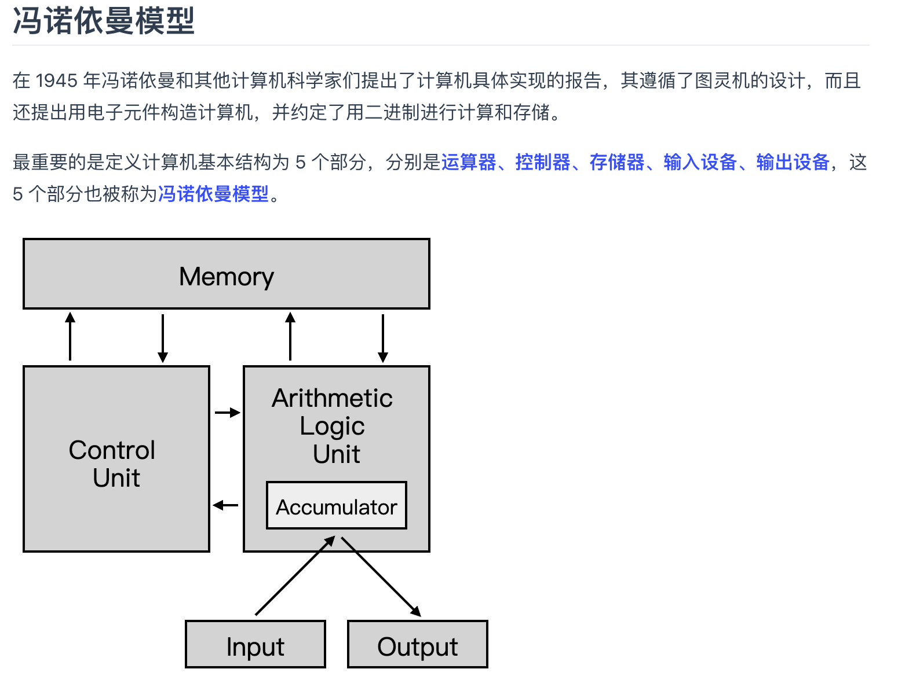
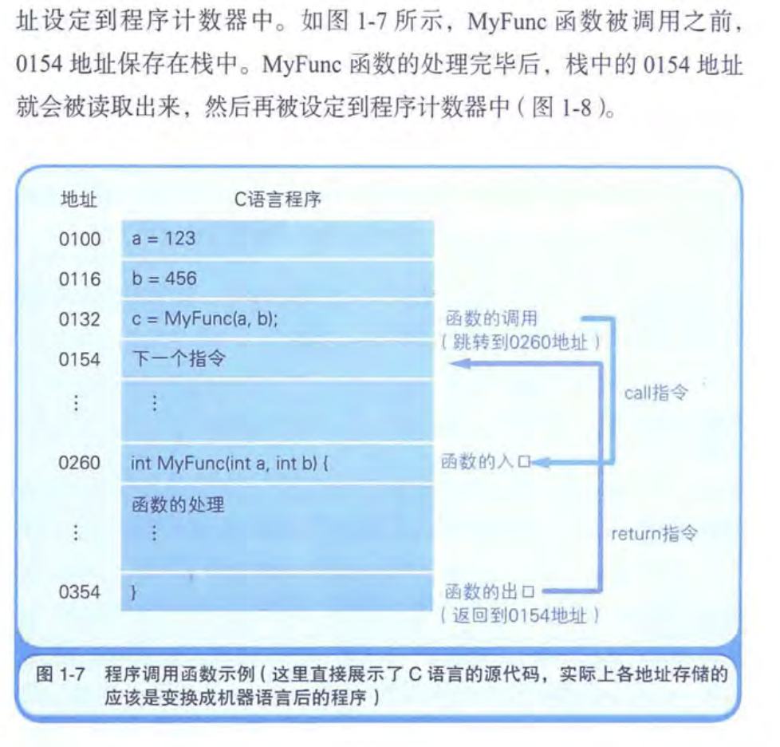
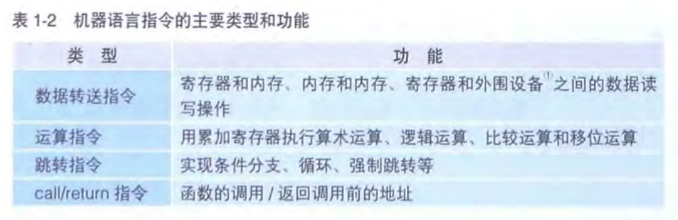
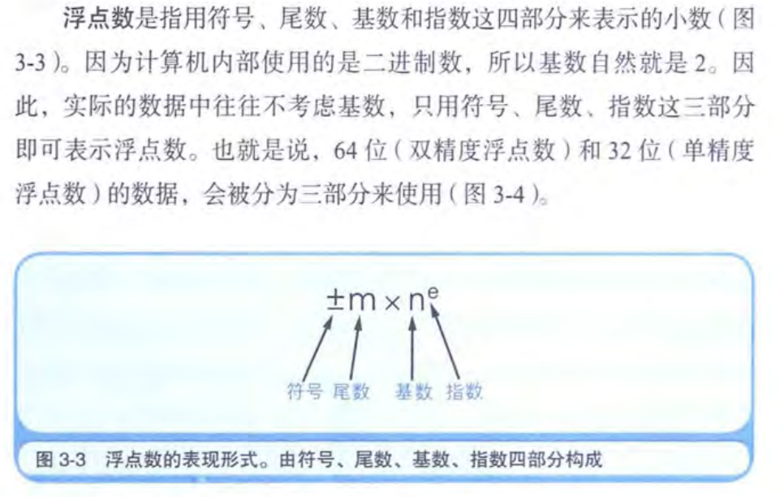
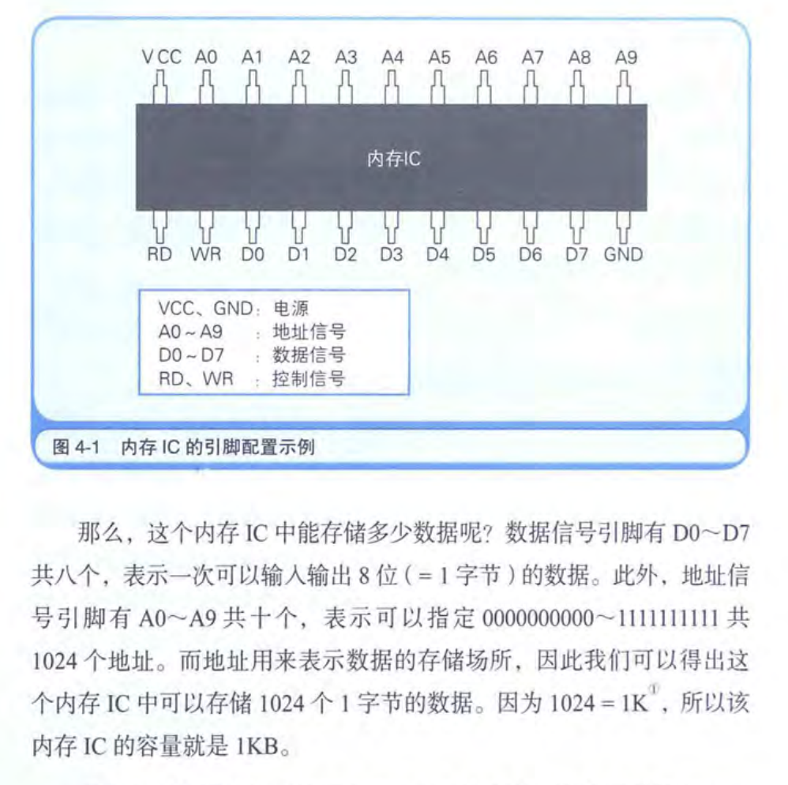
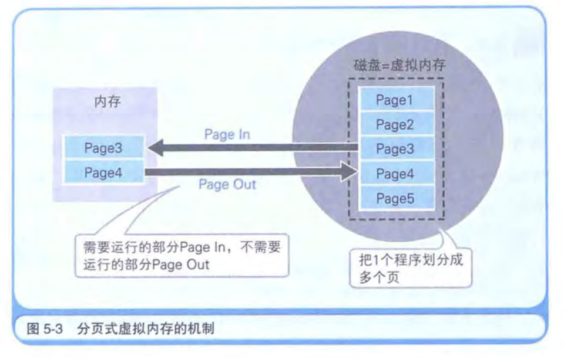
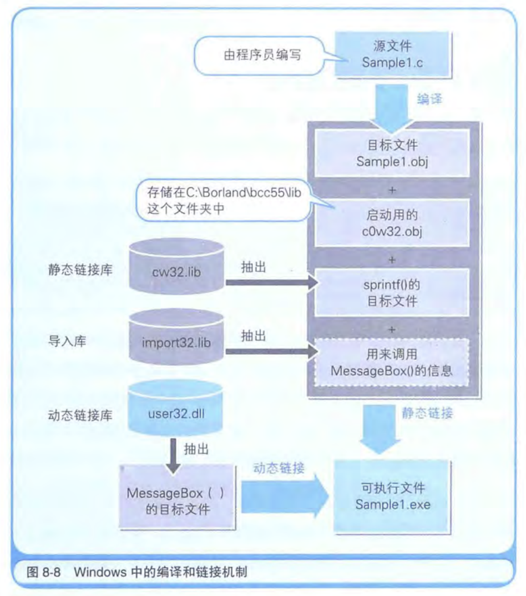
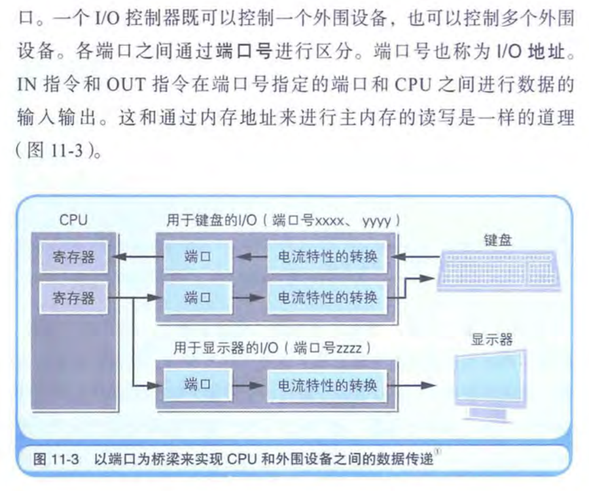
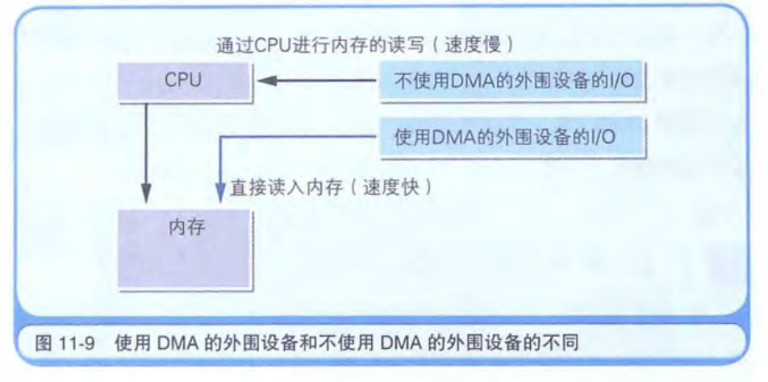

# 程序是怎样跑起来的

《程序是怎样跑起来的》（第3版）这本书作为基础入门书籍很不错，下面我将根据目录与各方读者的评论、摘要，逐章讲解本书的核心内容，最后进行总体的总结，并说明这本书的作用与意义。

---

## 各章解析

### 第一章：对程序员来说，CPU到底是什么  
CPU (central processing unit, 中央处理器)就是计算机的大脑, 作用是**解释和执行转换成机器语言的程序内容**：
- **CPU内部结构**：CPU 由寄存器、控制单元、运算单元（ALU）和时钟组成。
- **寄存器的作用**：CPU 实际上是由多个功能各异的寄存器组成，这些寄存器各自承担着数据暂存、地址保存等任务。
- **程序计数器 (PC)**：程序计数器如何决定程序的执行流程，每执行一条指令后 PC 自动更新，从而实现程序的顺序执行、分支和循环。

  

- **函数调用机制**：函数调用由call和return两个指令构成，call把当前指令的“下一条地址”压入栈中并把 PC 改为函数的入口地址，return从栈中“弹出”之前保存的返回地址并把 PC 设置为这个地址。

  

- **机器指令/汇编指令**：

  

通过这一章，可以了解到计算机“看不见”的硬件世界是如何为软件执行提供基础支持的；而对于程序员来说，理解CPU工作原理有助于写出更高效、更节能的代码。至少对计算机运行机制有个基本印象。深入理解cpu参考机组一文。

---

### 第二章：用二进制来理解数据  
首先应该清楚二进制的来源是集成电路Integrated circuit，比如cpu和内存就是IC的一种，因为IC的引脚只有0V和5V两种状态，所以计算机的信息数据只能用二进制数来处理：
- **二进制数及其运算**：8位一个字节，32位的cpu是指cpu内部的数据总线是32位的，一次能处理32位二进制数信息，和cpu的物理层面引脚数无关。
- **补码与移位**：移位就是扩大或者缩小的方式，二进制左移就会变成以前的2倍、4倍、8倍...右移就会变成以前的1/2、1/4、1/8...
补码是将二进制数取反再加1，补码的由来是因为计算机内部进行减法需要用加负数的形式实现，补码这个定义是在进行二进制减法中推出来的，比如100-001=011，也就是100+001的负数=011，那么推出来001的负数是111也就是取反加1，所以表示负数时需要补码。
- **逻辑运算的窍门**：逻辑右移补0，算数右移补1。

这一章的内容不仅解释了数字计算的根本原理，也是日后理解各种数据表示（如浮点数）的基础。

---

### 第三章：计算机在计算小数时会出错的原因  
本质是数学上的问题，计算机使用的是有限位数的二进制补码 来近似表达一个无限小数：
- **数值精度问题**：通过实例说明为何像 0.1 这种看似简单的数字反复相加后结果不精确，揭示了**二进制无法精确表示某些十进制小数的原因**。
- **浮点数的内部表示**：二进制表示小数，双精度浮点数类型用64位，单精度用32位。

- **误差累积与避免策略**：一是回避策略就是实际有亿万分之一的误差对目的不影响，二是把小数转换成整数来处理，整数就不会有错误了BigInt。

> Tips: 4位二进制就是1位16进制，也即两个16进制表示一个字节

这章内容帮助程序员认识到底层数值误差的重要性，在编写需要高精度计算的程序时能够有意识地规避潜在问题。

---

### 第四章：让内存化方为圆  
本章围绕内存展开，主要讲解内存管理与数据结构：
- **物理与逻辑内存结构**：介绍内存的物理构造（以电子元件和存储芯片为例）和逻辑结构（比喻成一幢大楼），帮助读者理解内存如何组织数据。内存基本结构如下图，能够RD根据address地址读出数据，也能WR写到address里。

- **指针与数组**：指针通俗的说是门牌号，也就是内存地址，同时也是一个变量意味着内存里也有一个地方放着这个变量的数据，通常是栈。
- **常见数据结构**：进一步介绍了栈、队列、环形缓冲区、链表以及二叉查找树，解释了它们在实现高效数据存储与检索中的优势和应用场景。深入理解数据结构需要参考数据结构与算法部分。

通过这一章，读者能够理解内存的工作原理及如何合理利用内存资源，这对优化程序性能非常重要。

---

### 第五章：内存与磁盘的密切联系  
内存使用电流存储，磁盘使用磁效应。以前是通过改变计算机布线来变更程序，现在是 存储程序方式，意思是说程序保存在存储设备里，通过被有序读出来来实现运行：
- **内存与磁盘的角色**：程序必须先加载到内存才能执行，磁盘作为大容量长期存储设备与高速内存之间的配合关系。磁盘缓存是指把磁盘中的数据存储到内存大大增加访问速度，
缓存也就是把低速设备的数据保存在高速设备中。
- **磁盘缓存与虚拟内存**：虚拟内存实际上把一部分磁盘拿来当内存，但是正在运行的程序部分在这个时间点必须存在内存中，也就说需要把实际内存的内容和虚拟内存的内容进行置换，达到看起来是同时运行的效果。如果程序运行的那一刻，它需要用到的数据不在在物理内存中，程序访问会触发 “缺页异常”，操作系统就会：从磁盘（虚拟内存）里找到那一页并把它加载进内存，如果内存满了，就会**置换**掉当前 RAM 中某些不活跃的页面。虚拟内存有分页式分段式两种，windows采用的是分页式：

- **节约内存的编程技巧**：第一种方法是DLL文件，同一个函数在两个程序里内置的方式叫静态链接，那么把这个函数拿出来单独成一个DLL文件可被多个程序共有，提高内存使用效率。第二个方式是_stdcall，比如减少栈清理的次数。
- **磁盘的物理结构**：磁盘的读写最小单位是扇区，windows对磁盘进行读写的单位是整数倍簇。不管是多么小的文件都会占用一簇的空间，否则就会导致其他文件无法删除。

这章让你明白了操作系统是如何协调内存与磁盘之间的工作，从而使得大型程序能够顺利运行。深入置换过程参考操作系统虚拟内存部分。

---

### 第六章：自己动手压缩数据  
本章转向数据压缩与算法，文件以字节为单位保存：
- **文件存储基础**：半角(标准英文字母的宽度)英文数字一个字节，全角字符两个字节，数据压缩需要考虑字节级别的存储细节。
- **RLE 算法**：游程编码（Run-Length Encoding）就是“数据✖️重复次数”，优点是压缩率高，局限性是实际文本中字符重复不多见。
- **哈夫曼编码的基础**：从莫尔斯码中引出哈夫曼编码的思想，多次出现的数据用小于8位的字节数表示。
  
这一章不仅对数据压缩算法有一个初步的认识，同时也体会到算法在实际工程中提高存储效率的重要性。

---

### 第七章：程序在怎样的环境下运行  
本章主要讲述程序的运行环境，即硬件和操作系统的结合：
- **运行环境的定义**：指出程序的运行依赖于操作系统与硬件的组合，解释为何同一程序在不同平台上可能无法通用。
- **操作系统的作用**：操作系统消除硬件差异，通过不同的API（应用程序接口）供程序调用，从而使得程序能够跨平台运行。
- **虚拟化技术**：利用虚拟机（如 Java 虚拟机或其他云计算平台）来提供一致的运行环境，这也是现代软件跨平台运行的重要方法。
- **BIOS与引导程序**：计算机启动时 BIOS(Basic Input/Output System)的作用是检查硬件正常及引导装入程序将操作系统加载到内存中。

这章内容有助于理解程序不仅仅运行于代码层面，更依赖于整个系统的运行环境，是软件开发与系统架构中重要的一环。

---

### 第八章：从源文件到可执行文件  
本章揭示了程序从编写到运行的转换过程，从源代码到本地代码，通过预处理、编译、汇编、链接四个步骤最终生成可执行文件：
- **源文件与本地代码**：解释编程语言写的源代码最终如何被转换为计算机能够识别的机器语言（本地代码）。
- **编译与链接过程**：详细说明编译器是如何将源代码转换成汇编语言，再经由汇编器得到机器代码，链接器如何整合多个目标文件与库文件生成可执行文件。

- **启动过程**：程序启动时需要的附加内容，如启动代码、库文件、动态链接库（DLL）以及栈和堆的生成等。
- **附加问答**：回答一些关于可执行文件生成和加载过程中的常见问题，进一步加深对整个流程的理解。

这一章帮助理解软件从编写到运行的整个工具链过程，是连接高层语言与底层执行的桥梁。

---

### 第九章：操作系统与应用程序的关系  
本章探讨操作系统与应用程序之间的密切关联：
- **操作系统的历史与演变**：操作系统从简单监控程序发展为现代多任务、多用户系统，监控程序是用来加载和运行程序。
- **系统调用**：应用程序是通过调用操作系统提供的系统调用接口来间接控制硬件，从而实现诸如文件操作、网络通信、设备驱动等功能。通过WYSIWYG的方式实现打印输出。
操作系统提供的网络功能和数据库功能是中间件，两者合在一起叫系统软件
- **硬件抽象**：讨论了操作系统和高级语言如何抽象底层硬件，使得编程更为方便和跨平台，这也是高层语言能够“移植性”强的重要原因。

这章内容能让我们明白应用程序背后依赖的是操作系统提供的抽象层，理解这一层对于编写跨平台和高效应用非常关键。

---

### 第十章：通过汇编语言认识程序的真面目  
本章走进更低层次的“机器级”世界，本地代码指令表示功能的英文称为助记词，汇编.asm：
- **汇编语言与机器码对应关系**：介绍汇编语言如何将抽象的程序指令用助记符形式表达，并与实际机器指令一一对应。
- **编译器与汇编输出**：讨论利用 C 语言编译器输出汇编语言代码的方法，让人更直观地看到高级代码是如何翻译成底层指令的。
- **伪指令与汇编语法**：解析伪指令的作用以及汇编语言中“操作码+操作数”这种语法结构，并重点介绍常用指令如 mov、push/pop 等，以及函数调用、循环和分支在汇编层面的实现原理。
  
这一章可以帮助理解程序运行的实际构成和执行过程，对于想深入了解系统原理和优化程序性能的人尤其重要。深入汇编参考机组一文。

---

### 第十一章：访问硬件的方法  
本章聚焦于程序如何与硬件直接打交道，计算机主机无法与外围设备直接连通，那么就需要I/O控制器，其中含有临时保存输入输出数据的内存，也就是端口：
- **硬件I/O指令**：使用 IN、OUT 指令实现对硬件的输入输出操作，以及这些低级指令在系统中起到的作用。

- **中断处理与DMA技术**：中断IQR(Interrupt Request)是暂停当前正在运行的的程序跳转到其他程序运行的必要机制，中断请求如何让 CPU “响应”外围设备的操作。按照顺序调查多个外围设备的状态称为轮询。直接内存存取（DMA，Direct memory access）技术在大规模数据传输中提高速度，从而提升系统的实时性与数据处理能力。

- **显示原理**：显卡一般配置有VRAM和GPU，显示器的信息一直存储在VRAM里。

对理解硬件控制和系统性能优化有直接帮助，对于系统编程和嵌入式开发者来说，这是不可忽视的知识。

---

### 第十二章：如何让计算机“思考”  
本章稍微超出传统意义上的硬件与系统知识，探讨初步的人工智能内容，个人认为本章及说明计算机本身没有思考功能(无法真正生成随机数)：
- **机器学习基础**：介绍什么是机器学习，尤其是支持向量机（SVM）等初步方法。
- **Python在机器学习中的应用**：通过 Python 交互模式和实际数据集来展示手写数字识别的基本原理，提供一个简单的实验平台，让初学者能亲身体验 AI 的应用。
- **交叉验证与模型评估**：简单说明如何使用交叉验证技术来检查模型效果，帮助读者感受到计算机“学习”数据并进行预测的整个流程。

这一章不仅了解传统“程序运行”的知识，还初步接触到当下热门的人工智能技术，拓宽了知识面。

---

### 附录部分  
书末附录分别介绍了 C 语言和 Python 的基本知识，帮助读者即使没有编程基础也能快速上手，并将书中讲解的硬件与底层原理与实际代码联系起来。这部分内容适合初学者进一步巩固对编程语言的认识，并进行实践操作。

---

## 总括与本书的意义

### 本书讲了什么？
《程序是怎样跑起来的》从计算机内部结构出发，以图文并茂、通俗易懂的方式介绍了：
- **计算机硬件的基本组成**（如 CPU、内存、磁盘、BIOS 等）以及它们如何合作完成程序的执行；
- **数据的底层表示**，用二进制说明了计算机如何理解数字、字符与图像；
- **程序从源代码到可执行文件的转换过程**——从编译、链接到加载执行；
- **操作系统的作用**，解释了它如何作为中介，将应用程序与底层硬件隔离；
- **汇编语言的基本原理与机器码对应关系**，帮助深入了解程序执行的真正过程；
- **数据压缩及现代计算（如机器学习）的初步尝试**，拓展了知识的边界。

### 这本书有什么用？
1. **建立底层认识**  
   通过理解计算机硬件和软件之间的联系，程序员可以更好地优化代码和排除系统性错误，避免那些看似神秘但实际有迹可循的底层问题。
2. **架构设计与性能调优**  
   理解内存、磁盘、虚拟内存和系统调用等内容，有助于在设计软件系统、进行性能优化和解决跨平台问题时做到心中有数。
3. **跨学科普及**  
   书中“如果是你，你会怎样讲呢？”的专栏设计，使得复杂的计算机原理能向不同背景和年龄段的人（例如小学生、女高中生、老奶奶）解释清楚，具有科普和传播计算机科学知识的独特价值。
4. **激发兴趣与进一步学习**  
   对初学者来说，这本书是一本入门桥梁，不仅能帮助建立对计算机系统全貌的认识，还激发深入学习（例如汇编语言、操作系统、编译原理、甚至机器学习）的兴趣。

---

## 总结  
我认为本书最大的作用是初步建立一个计算机的框架体系，然后对重点部分再深入，形成个人对计算机的深刻见解。
最后以我的计算机启蒙，浙大的翁凯老师的话结尾：
>计算机的所有东西都是人做出来的，别人能想的出来的，我也一定能想的出来，在计算机里头没有任何黑魔法，所有的东西只不过是我现在不知道而已，总有一天我会把所有细节，所有内部的东西全都搞明白的。

