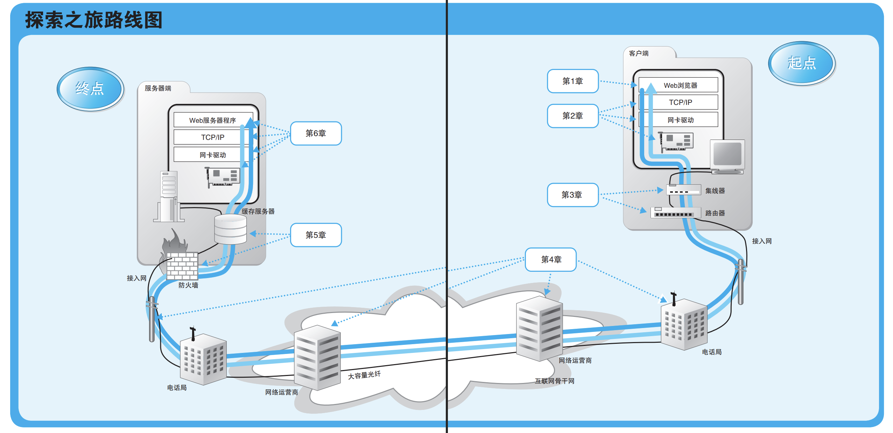

# 网络是怎样连接的

《网络是怎样连接的》是与《程序是怎样跑起来的》同系列的图解网络入门书籍。本书以生动有趣的方式，通过跟随一个数据包从发送到接收的全过程，详细讲解了计算机网络的工作原理。下面我将根据各章内容进行总结，同时我认为这本书的重要意义是在于讲清楚了从在浏览器输入地址到显示出页面信息短短几秒中经历的底层硬件和软件的过程。

---

## 各章解析

### 第一章：浏览器生成消息
当我们在浏览器中输入网址并按下回车键时,：

- **浏览器如何解析网址**：浏览器主要是解析URL，生成HTTP消息
- **HTTP请求消息的生成**：
  浏览器在解析完URL后，会根据用户的操作（如输入网址、点击链接、提交表单等）生成一条HTTP请求消息。HTTP请求主要包括三部分：
  1. **请求行**：如 `GET /index.html HTTP/1.1`，表示请求方法、目标资源路径和HTTP协议版本。
  2. **请求头部（Header）**：包含浏览器类型（User-Agent）、可接受的内容类型（Accept）、主机名（Host）、Cookie等信息，用于描述客户端环境和请求细节。
  3. **请求体（Body）**：主要用于POST、PUT等方法，携带表单数据或JSON等内容。
  浏览器会根据HTTP协议规范自动补全必要的头部字段，并对请求体进行适当编码（如表单数据会被编码为`application/x-www-form-urlencoded`或`multipart/form-data`）。最终，完整的HTTP请求消息会被准备好，等待发送。
- **消息格式与规范**：请求消息包含请求行、首部字段、主体等部分，遵循HTTP协议规范。
- **DNS查询准备**：需要将域名转换为IP地址，准备进行DNS查询。
- **DNS怎么接力**：
  在HTTP请求消息生成后，浏览器需要将域名（如 www.example.com）转换为对应的IP地址，这一过程称为DNS解析。DNS解析通常分为以下几个步骤：
  1. **本地缓存查询**：浏览器和操作系统会先查找本地DNS缓存，看是否有该域名的IP地址记录。
  2. **递归查询**：如果本地没有，操作系统会向配置的DNS服务器（通常是运营商或公共DNS）发起递归查询。
  3. **分级查询**：DNS服务器如果也没有，会逐级向根域名服务器、顶级域名服务器（如.com）、权威域名服务器发起查询，直到获得最终的IP地址。
  4. **结果返回**：IP地址返回给操作系统，再传递给浏览器，浏览器就可以用这个IP地址来建立后续的网络连接。
  整个DNS解析过程通常只需几十到几百毫秒，但对于首次访问的新域名，DNS查询的延迟会直接影响页面加载速度。
- **浏览器把消息委托给OS发送给Web Server**：
  当HTTP请求消息和目标服务器的IP地址都准备好后，浏览器会调用操作系统的网络接口（如Socket API），将请求消息交给操作系统的网络协议栈处理。具体过程如下：
  1. **建立TCP连接**：操作系统根据IP地址和端口（通常是80或443，端口可以理解为进程ID）与目标Web服务器建立TCP连接（三次握手）。
  2. **数据封装**：HTTP请求消息会被封装进TCP数据包，再加上IP头部、MAC头部等，形成完整的网络数据帧。
  3. **数据发送**：操作系统通过网卡驱动，将数据包以电信号形式发送到网络中，开始数据的传输之旅。
  4. **异步处理**：浏览器会等待操作系统返回的响应数据，并在收到服务器响应后进行后续处理（如渲染页面）。
  这一过程实现了应用层（浏览器）与底层网络硬件的解耦，保证了网络通信的高效与安全。

### 第二章：用电信号传输TCP/IP数据
数据包在网络中传输的物理基础，网络控制软件（协议栈），网络硬件（网卡）：

- **协议栈和网卡**：
  - 协议栈处理TCP/IP消息收发
  - 网卡驱动程序控制网卡硬件
  - 网卡将数字信号转换为电信号

- **数据包结构**：
  - MAC头部：负责以太网通信
  - IP头部：负责网络包传输
  - TCP头部：负责可靠传输
  - HTTP消息：应用层数据

### 第三章：从网线到网络设备
探索数据包在局域网中的传输过程：

- **网线和双绞线**：
  - 信号传输原理
  - 全双工通信
  - 串扰防护

- **集线器和交换机**：
  - 集线器的广播模式
  - 交换机的智能转发
  - MAC地址学习功能

### 第四章：通过路由器传输到目标
数据包如何在互联网中进行路由：

- **路由器的基本功能**：
  - 路由表维护
  - 包转发机制
  - 路径选择算法

- **互联网结构**：
  - 骨干网络
  - 互联网服务提供商（ISP）
  - 网络层次结构

### 第五章：服务器端的局域网
探索数据中心和服务器端网络架构：

- **防火墙与负载均衡**：
  - 访问控制规则
  - 负载分配策略
  - 会话保持机制

- **服务器集群**：
  - 多服务器协同
  - 高可用性设计
  - 数据同步机制

### 第六章：请求到达Web服务器
数据包最终到达目标服务器后的处理：

- **Web服务器工作流程**：
  - 接收连接请求
  - 处理HTTP请求
  - 响应生成与发送

- **服务器程序架构**：
  - 多进程/多线程模型
  - 事件驱动模型
  - 并发处理机制

### 第七章：网络包旅程的返回路径
响应数据如何返回到客户端：

- **响应处理过程**：
  - 响应消息生成
  - TCP连接维护
  - 流量控制机制

- **网络拥塞控制**：
  - 拥塞窗口调整
  - 慢启动算法
  - 快重传和快恢复

## 总括与本书的意义

### 本书讲了什么？
《网络是怎样连接的》通过跟随一个网络包的完整旅程，详细介绍了：

- **网络通信的基础设施**：从网线到路由器的硬件设备
- **协议栈的工作机制**：TCP/IP协议族的详细工作过程
- **网络安全与性能**：防火墙、负载均衡等关键技术
- **服务器端架构**：Web服务器的工作原理与设计思想

### 这本书有什么用？

1. **建立网络认知**
   - 理解网络通信的完整过程
   - 掌握网络故障排查的思路
   - 了解网络性能优化的方法

2. **实践指导**
   - 网络配置与管理的最佳实践
   - 服务器部署与维护的关键点
   - 网络安全防护的基本策略

3. **架构设计参考**
   - 网络架构设计的原则
   - 高可用系统的设计思路
   - 性能优化的实践方法

4. **学习路径指引**
   - 网络工程师的知识体系
   - 系统架构师的进阶方向
   - 网络安全专家的发展路线

## 总结
本书最大的价值在于它将复杂的网络知识通过具体的数据包传输过程展现出来，让读者能够建立起完整的网络知识体系。通过学习这本书，我们不仅能理解网络的工作原理，还能在实际工作中更好地解决网络问题、优化网络性能。

正如计算机网络的设计理念一样，这本书告诉我们：
> 再复杂的网络系统，都是由简单的协议和机制组合而成。理解了基础原理，就能掌握整个网络系统的工作方式。
